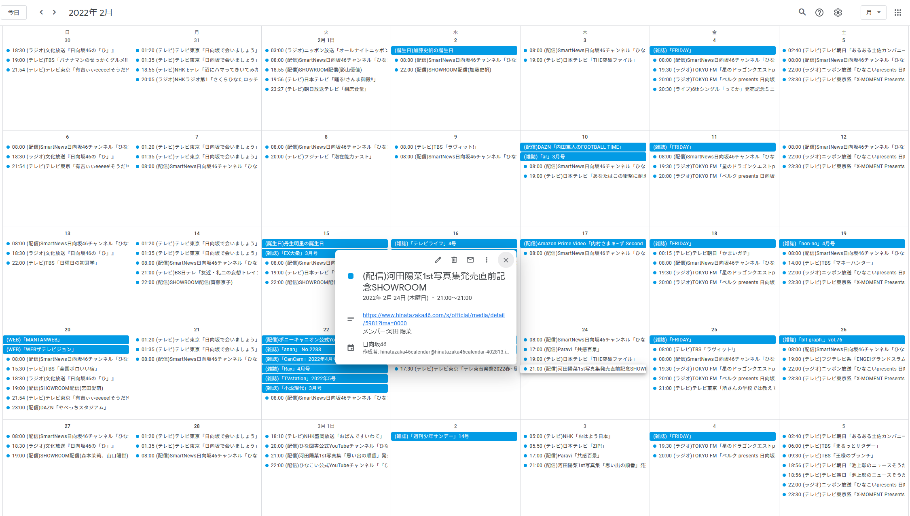

# Hinatazaka46Calendar

日向坂46のスケジュールをGoogleカレンダーへ登録するためのアプリケーションです。  
[こちら](https://qiita.com/ddn/items/42def5fa721e531eecdb)で紹介されている[Googleカレンダー](https://calendar.google.com/calendar/u/0?cid=dnExNGh0OW5pZWUydTIwMGc0cmtkc3VoN3NAZ3JvdXAuY2FsZW5kYXIuZ29vZ2xlLmNvbQ)が 2023/02頃から稼働しておらず、勝手ながら本リポジトリを立ち上げました。

## Googleカレンダー共有リンク

https://calendar.google.com/calendar/u/0?cid=NTdmMmYyYTc2NmEzNmExOWZhZjQ3ODcwNzExNTA5OTE0ZGM4N2YzNzRmYjAzYzM4MTQwZTIyZTA2ZjdlZDFjNEBncm91cC5jYWxlbmRhci5nb29nbGUuY29t

本リポジトリはRender.com の CRON JOB としてデプロイしており、上記Googleカレンダーへ自動的に登録されるようになっています。(3か月先の予定まで)  
Googleアカウントをお持ちであれば、上記URLからご自身のGoogleカレンダーへ反映させることができます。  

日向坂46HPのWebサーバへの負荷を最小限にするためにも、上記のGoogleカレンダーが稼働している限りは、個別に本リポジトリをデプロイさせないでください。

なお、日向坂46HPの仕様変更等に伴って動作しなくなった場合のプルリクは大歓迎です。
