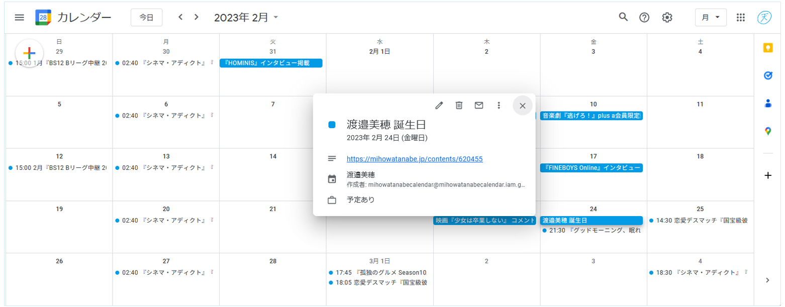

# MihoWatanabeCalendar

渡邉美穂さんのスケジュールを自身のGoogleカレンダーへ追加できるようにすることで、推し活ライフのサポートを目指しています。  
[こちら](https://github.com/CircleTenThanks/Hinatazaka46Calendar.git)をベースに作っています。

## Googleカレンダー共有リンク

* ご自身のGoogleアカウントに追加したい方は [こちら](https://calendar.google.com/calendar/u/0?cid=MmRlNTcwZjRjM2Q4OTUzZGE3MzAwMTRlNWY4YmQyM2Q5NGE1Y2Q3NzU3ODM2M2FiOTc1OTBkODEwOTkxYjM5ZEBncm91cC5jYWxlbmRhci5nb29nbGUuY29t) 
    * うまく行かない場合は [#1](https://github.com/CircleTenThanks/Hinatazaka46Calendar/issues/1#issuecomment-1783007351) (`日向坂46`は`渡邉美穂`に読み替えてください)
* ブラウザ上でGoogleカレンダーを見たい方は[こちら](https://calendar.google.com/calendar/embed?src=2de570f4c3d8953da730014e5f8bd23d94a5cd77578363ab97590d810991b39d%40group.calendar.google.com&ctz=Asia%2FTokyo)
    * スマホの場合は右上の`予定リスト`をタップすると見易くなります。

## 仕組み

本リポジトリはRender.com の CRON JOB としてデプロイしており、上記Googleカレンダーへ自動的に登録されるようになっています。

渡邉美穂さんHPのWebサーバへの負荷を最小限にするためにも、上記のGoogleカレンダーが稼働している限りは、個別に本リポジトリをデプロイさせないでください。

なお、渡邉美穂さんHPの仕様変更等に伴って動作しなくなった場合のプルリクは大歓迎です。
